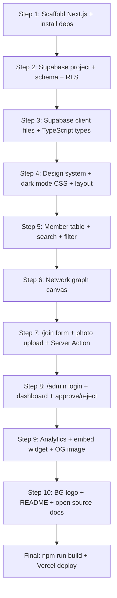

# bracu.network — Updated Implementation Plan (with Supabase)

> Self-registration webring for BRAC University students. Dark mode. Supabase backend. Scales to 500+ members.

## Why Supabase from Day 1

Posting in BRACU Facebook groups = non-technical students, high volume, no GitHub knowledge.
The static PR-based approach only works for small technical communities.
With Supabase: anyone fills a form → you approve in a dashboard → they appear on the site.

## Decisions Locked

| Decision | Choice |
|----------|--------|
| Database | **Supabase PostgreSQL** |
| Auth | **Supabase Auth** (email/password — admin only) |
| File Storage | **Supabase Storage** (profile photos) |
| Join Flow | **Web form** on the site (no GitHub required) |
| PR Route | **Still supported** for technical members who prefer it |
| Theme | **Dark mode** |
| Network Graph | **Replicate** uwaterloo.network's force-directed graph |
| Seed Members | **You + a few friends** (inserted directly into Supabase) |
| Deployment | **Vercel** (free tier, automatic previews) |
| Domain | Vercel default URL for now |

---

## Architecture Overview

```
User visits bracu.network
        │
        ▼
Next.js 15 (App Router) on Vercel
        │
        ├── Homepage  ──────► Supabase DB  (fetch approved members, ISR every 60s)
        ├── /join     ──────► Supabase DB  (insert pending member)
        │             ──────► Supabase Storage (upload photo)
        └── /admin    ──────► Supabase Auth (login gate)
                      ──────► Supabase DB  (approve/reject pending members)
```

### Data Flow — Joining the Webring
```
1. Person fills out /join form
2. Photo → Supabase Storage bucket → returns public URL
3. Form data + photo URL → INSERT into members table (is_approved = false)
4. Success screen shown to user
5. You log into /admin → see pending members
6. Click Approve → is_approved = true → member appears on homepage within 60s
   OR
   Click Reject → record deleted
```

---

## Step 1 — Project Scaffold

**Goal:** Initialize Next.js project and install all dependencies in one shot.

### Command
```bash
npx -y create-next-app@latest ./ \
  --typescript --app --eslint --src-dir \
  --no-tailwind --import-alias "@/*"
```

### Dependencies to install
```bash
npm install @supabase/supabase-js @supabase/ssr lucide-react clsx @next/third-parties server-only slugify sharp
```

> [!NOTE]
> `server-only` prevents accidental import of server code into client bundles.
> `slugify` handles Unicode-safe slug generation.
> `sharp` strips EXIF metadata (GPS location) from uploaded photos.

### Files created/configured
- `package.json` — all dependencies
- `next.config.ts` — **must include Supabase Storage image domain** (see below)
- `tsconfig.json` — path aliases
- `.gitignore` — includes `.env.local`
- `.env.example` — template (committed to git)
- `.env.local` — real secrets (NOT committed)

### `next.config.ts` — 🔴 FIX #10: Supabase Storage image domain
```typescript
import type { NextConfig } from 'next';

const nextConfig: NextConfig = {
  images: {
    remotePatterns: [
      {
        protocol: 'https',
        hostname: '*.supabase.co',
        pathname: '/storage/v1/object/public/**',
      },
    ],
  },
};

export default nextConfig;
```

> [!IMPORTANT]
> Without this, `next/image` throws a runtime error for every profile photo from Supabase Storage.
> The entire member table breaks on production without it.

### `.env.example`
```env
# Supabase
NEXT_PUBLIC_SUPABASE_URL=https://xxxxx.supabase.co
NEXT_PUBLIC_SUPABASE_ANON_KEY=your_anon_key_here
SUPABASE_SERVICE_ROLE_KEY=your_service_role_key_here

# Analytics
NEXT_PUBLIC_GA_MEASUREMENT_ID=G-XXXXXXXXXX
NEXT_PUBLIC_CLARITY_PROJECT_ID=xxxxxxxxxx
```

### `.github/workflows/ci.yml` — Set up CI now, not at Step 10
```yaml
name: CI
on:
  pull_request:
    branches: [main]
jobs:
  build:
    runs-on: ubuntu-latest
    steps:
      - uses: actions/checkout@v4
      - uses: actions/setup-node@v4
        with: { node-version: '20', cache: 'npm' }
      - run: npm ci
      - run: npm run lint
      - run: npm run build
        env:
          NEXT_PUBLIC_SUPABASE_URL: ${{ secrets.NEXT_PUBLIC_SUPABASE_URL }}
          NEXT_PUBLIC_SUPABASE_ANON_KEY: ${{ secrets.NEXT_PUBLIC_SUPABASE_ANON_KEY }}
```

> [!IMPORTANT]
> CI must be live before any community PRs arrive. Enable branch protection on GitHub (require CI to pass before merge).

---

## Step 2 — Supabase Setup

**Goal:** Configure the database schema, storage bucket, and security policies.

> [!NOTE]
> This step is done in the **Supabase dashboard** at supabase.com, not in code.
> After setup, the generated credentials go into `.env.local`.

### 2a — Create Supabase Project
1. Go to supabase.com → New Project
2. Name: `bracu-network`
3. Choose a strong database password (save it)
4. Region: Southeast Asia (Singapore) — closest to Bangladesh

### 2b — Database Schema (SQL to run in SQL Editor)
```sql
-- Members table
CREATE TABLE members (
  id          UUID DEFAULT gen_random_uuid() PRIMARY KEY,
  slug        TEXT UNIQUE NOT NULL,       -- "rubayet-hassan" (URL-safe ID)
  name        TEXT NOT NULL,
  email       TEXT,                       -- optional, not displayed publicly
  website     TEXT NOT NULL,
  department  TEXT,
  batch       TEXT,                       -- e.g. "Spring 2022"
  roles       TEXT[] DEFAULT '{}',        -- ["engineering", "design"]
  interests   TEXT[] DEFAULT '{}',        -- ["ai", "fintech"]
  profile_pic TEXT,                       -- Supabase Storage public URL
  instagram   TEXT,
  twitter     TEXT,
  linkedin    TEXT,
  github      TEXT,
  connections TEXT[] DEFAULT '{}',        -- array of member slugs
  is_approved BOOLEAN DEFAULT false,
  created_at  TIMESTAMPTZ DEFAULT now(),
  updated_at  TIMESTAMPTZ DEFAULT now()
);

-- Auto-update updated_at on row change
CREATE OR REPLACE FUNCTION update_updated_at()
RETURNS TRIGGER AS $$
BEGIN
  NEW.updated_at = now();
  RETURN NEW;
END;
$$ LANGUAGE plpgsql;

CREATE TRIGGER set_updated_at
  BEFORE UPDATE ON members
  FOR EACH ROW EXECUTE FUNCTION update_updated_at();
```

### 2c — Row Level Security (RLS) Policies

> [!IMPORTANT]
> **🔴 FIX #1 (spam) + #2 (broad admin check) applied here.**
> The original plan had two critical flaws:
> 1. An open INSERT policy let anyone flood the DB with fake rows directly via the anon key.
> 2. `auth.role() = 'authenticated'` grants UPDATE/DELETE to **any** logged-in user, not just the admin.
> Both are fixed below.

```sql
-- Enable RLS
ALTER TABLE members ENABLE ROW LEVEL SECURITY;

-- Unique constraints to prevent duplicate submissions
ALTER TABLE members ADD CONSTRAINT unique_website UNIQUE (website);

-- Anyone can read approved members (public directory)
CREATE POLICY "Public can view approved members"
  ON members FOR SELECT
  USING (is_approved = true);

-- 🔴 FIX #1: NO open INSERT policy.
-- All inserts are performed server-side via adminClient (service_role key)
-- which bypasses RLS entirely. The anon key has zero INSERT access.
-- This blocks spam bots from writing directly to the DB.

-- 🔴 FIX #2: Use auth.uid() — NOT auth.role() — to scope admin access
-- to YOUR specific account only. Replace the UUID below after creating
-- your admin user (copy it from Supabase → Authentication → Users).
CREATE POLICY "Admin can update members"
  ON members FOR UPDATE
  USING (auth.uid() = 'YOUR-ADMIN-UUID-HERE'::uuid);

CREATE POLICY "Admin can delete members"
  ON members FOR DELETE
  USING (auth.uid() = 'YOUR-ADMIN-UUID-HERE'::uuid);
```

### 2d — Storage Bucket
```
Bucket name: profile-photos
Public: YES (photos are publicly viewable — read-only)
File size limit: 5MB
Allowed MIME types: image/jpeg, image/png, image/webp
```

### 2d-ii — Storage RLS Policies — 🔴 FIX #15

> [!IMPORTANT]
> Without Storage RLS, anyone who discovers the bucket URL can upload arbitrary files
> directly, completely bypassing your Server Action's MIME validation.
> The policy below blocks all direct public uploads — only your server (via service_role) can write.

In Supabase dashboard → Storage → profile-photos bucket → Policies, add:
```sql
-- Block ALL direct uploads via anon key
-- Your Server Action uses service_role (adminClient) which bypasses this
CREATE POLICY "Block direct public uploads"
  ON storage.objects FOR INSERT
  TO anon
  WITH CHECK (false);

-- Allow public read (photos must be viewable by everyone)
CREATE POLICY "Public can view profile photos"
  ON storage.objects FOR SELECT
  TO anon
  USING (bucket_id = 'profile-photos');
```

### 2e — Admin User
In Supabase dashboard → Authentication → Users → Add user:
- Email: your email address
- Password: strong password
- This is the only login that can access `/admin`

### 2f — Seed Initial Members
Insert you + friends directly via Supabase SQL Editor:
```sql
INSERT INTO members (slug, name, website, department, batch, roles, is_approved)
VALUES
  ('rubayet-hassan', 'Rubayet Hassan', 'https://yoursite.com',
   'Computer Science & Engineering', 'Spring 2022',
   ARRAY['engineering'], true),
  -- add friends here
  ;
```

---

## Step 3 — Supabase Client Setup (in code)

**Goal:** Create reusable Supabase clients for browser and server contexts.

### [NEW] `src/lib/supabase/client.ts`
```typescript
import { createBrowserClient } from '@supabase/ssr';

export function createClient() {
  return createBrowserClient(
    process.env.NEXT_PUBLIC_SUPABASE_URL!,
    process.env.NEXT_PUBLIC_SUPABASE_ANON_KEY!
  );
}
```

### [NEW] `src/lib/supabase/server.ts`
```typescript
import { createServerClient } from '@supabase/ssr';
import { cookies } from 'next/headers';

export async function createClient() {
  const cookieStore = await cookies();
  return createServerClient(
    process.env.NEXT_PUBLIC_SUPABASE_URL!,
    process.env.NEXT_PUBLIC_SUPABASE_ANON_KEY!,
    { cookies: { getAll: () => cookieStore.getAll(), setAll: (...) => ... } }
  );
}
```

### [NEW] `src/lib/supabase/admin-server.ts` — 🔴 FIX #3

> [!IMPORTANT]
> **Three problems with the original `admin.ts`:**
> 1. Module-level singleton — can be shared across requests in Vercel's module cache.
> 2. No `server-only` guard — if accidentally imported in a Client Component, the service_role key leaks into the browser bundle.
> 3. Named `admin.ts` — too easy to accidentally import anywhere.
>
> Fixed: renamed to `admin-server.ts`, uses `server-only`, exports a function not a singleton.

```typescript
import 'server-only'; // ← Build error if imported in a Client Component
import { createClient } from '@supabase/supabase-js';
import type { Database } from '@/types/database';

/**
 * Returns a Supabase client with service_role key.
 * Bypasses ALL RLS policies.
 * NEVER import this file in Client Components.
 * NEVER expose the returned client to the browser.
 */
export function getAdminClient() {
  return createClient<Database>(
    process.env.NEXT_PUBLIC_SUPABASE_URL!,
    process.env.SUPABASE_SERVICE_ROLE_KEY! // server-only secret
  );
}
```

> [!NOTE]
> Call `getAdminClient()` inside Server Actions and Route Handlers only.
> Each call creates a fresh client — safe under Vercel's serverless request model.

### [NEW] `src/types/member.ts`
```typescript
export interface Member {
  id: string;
  slug: string;
  name: string;
  email?: string;
  website: string;
  department?: string;
  batch?: string;
  roles: string[];
  interests: string[];
  profile_pic?: string;
  instagram?: string;
  twitter?: string;
  linkedin?: string;
  github?: string;
  connections: string[];
  is_approved: boolean;
  created_at: string;
}

export const ROLE_OPTIONS = [
  'engineering', 'design', 'product', 'ai/ml', 'research',
  'data science', 'cybersecurity', 'mobile dev', 'game dev',
  'entrepreneurship', 'content creation',
] as const;

export const DEPARTMENT_OPTIONS = [
  'Computer Science & Engineering',
  'Electrical & Electronic Engineering',
  'Architecture',
  'Economics & Social Sciences',
  'English & Humanities',
  'Mathematics & Natural Sciences',
  'Pharmacy',
  'Business Administration',
  'Law',
] as const;
```

---

## Step 4 — Design System & Layout

**Goal:** Build the dark-mode foundation — CSS variables, global styles, and page skeleton.

### [NEW] `src/app/globals.css`
Full dark-mode design system:
```css
:root {
  /* BRACU-inspired palette */
  --bracu-blue: #4A6CF7;          /* Vibrant blue accent (BRACU blue adjusted for dark) */
  --bracu-blue-dim: #253494;      /* Official BRACU blue */

  /* Backgrounds */
  --bg-primary:    #0A0A0A;
  --bg-secondary:  #141414;       /* Cards, elevated surfaces */
  --bg-tertiary:   #1E1E1E;       /* Inputs, hover states */

  /* Text */
  --text-primary:   #F5F5F5;
  --text-secondary: #A0A0A0;
  --text-muted:     #555555;

  /* Interactive */
  --accent:        #4A6CF7;
  --accent-hover:  #3858e0;
  --border:        #2A2A2A;
  --border-hover:  #3A3A3A;

  /* Misc */
  --radius: 8px;
  --font: 'Inter', -apple-system, sans-serif;
}
```

Includes:
- CSS reset
- Base typography (Inter from Google Fonts)
- Two-column responsive layout (left: content, right: graph)
- Table row styles + hover effects
- Input / button styles
- Background watermark positioning (BRACU logo, ~6% opacity, bottom-right)
- Mobile breakpoints (stacks columns below 768px)

### [MODIFY] `src/app/layout.tsx`
- Import Inter via `next/font/google`
- SEO: `<title>`, `<meta description>`, OG tags
- Include `<Analytics />` component

### [MODIFY] `src/app/page.tsx`
- **Server Component** — fetches approved members from Supabase at build/revalidation time
- Passes data to client components
- Two-column layout:
  - Left: hero text + `<MemberTable />`
  - Right: `<SearchBar />` + `<NetworkGraph />`

---

## Step 5 — Member Table + Search/Filter

**Goal:** Searchable, filterable directory that reads from Supabase.

### Data Fetching in `page.tsx`
```typescript
// Next.js ISR — rebuilds every 60 seconds
export const revalidate = 60;

const { data: members } = await supabase
  .from('members')
  .select('*')
  .eq('is_approved', true)
  .order('created_at', { ascending: true });
```

### [NEW] `src/components/MemberTable.tsx` (Client Component)
- Receives initial `members` as prop (SSR data)
- Local state for `searchQuery` + `activeFilters`
- Filters array client-side in real-time
- Columns: avatar + name | department | site | social icons
- Hover effect: subtle row background change
- Empty state: "No members match your search"
- Avatar fallback: initials if no profile photo

### [NEW] `src/components/SearchBar.tsx` (Client Component)
- Debounced text input (300ms)
- Magnifying glass icon (Lucide)
- Triggers re-filter of member list

### [NEW] `src/components/FilterDropdown.tsx` (Client Component)
- "filters ↓" button → dropdown panel
- Checkbox groups: Department, Roles
- Active filter count shown on button badge
- Click outside to close

### [NEW] `src/components/SocialIcons.tsx`
- Renders Instagram, X, LinkedIn, GitHub icons
- Only shows platforms the member has listed
- External link, opens in new tab

---

## Step 6 — Network Graph

**Goal:** Interactive force-directed graph — same visual as uwaterloo.network, BRACU-styled.

### [NEW] `src/components/NetworkGraph.tsx` (Client Component)

Implementation:
1. Receives `members` array as prop
2. Builds node list (one per member) + edge list (from `connections` field)
3. **Force simulation** (no D3 — pure JavaScript):
   ```
   repulsion:     800   (nodes push each other away)
   attraction:    0.05  (connected nodes pull together)
   damping:       0.9   (slows movement over time)
   centerGravity: 0.02  (gentle pull to canvas center)
   ```
4. Each tick: recalculate positions → redraw canvas
5. Drawing order: edges (thin `#2A2A2A` lines) → nodes (circular photos)
6. Profile photos: load via `<Image>` preloading, clip to circle on canvas
7. Hover: detect mouse position → highlight node + its edge connections in `--accent` blue
8. Canvas resizes with container (ResizeObserver)

Fallback: if no `profile_pic`, draw a circle with member initials in BRACU blue.

---

## Step 7 — Join Form (`/join`)

**Goal:** Self-registration page — no GitHub required. Anyone can apply.

### [NEW] `src/app/join/page.tsx`
Page layout with form and "How it works" sidebar.

### [NEW] `src/components/JoinForm.tsx` (Client Component)
Multi-field form:

| Field | Type | Required |
|-------|------|----------|
| Full Name | Text input | ✅ |
| Personal Website | URL input | ✅ |
| Department | Select dropdown | ✅ |
| Batch | Text input (e.g. "Spring 2024") | ❌ |
| Profile Photo | File upload (max 5MB, JPG/PNG) | ❌ |
| Roles | Multi-select checkboxes | ❌ |
| Interests | Multi-select checkboxes | ❌ |
| Instagram | URL input | ❌ |
| Twitter/X | URL input | ❌ |
| LinkedIn | URL input | ❌ |
| GitHub | URL input | ❌ |
| Email | Email input (not public) | ❌ |

### Form Submission Logic (`src/app/join/actions.ts` — Server Action)

```typescript
'use server';

import { z } from 'zod';
import slugify from 'slugify';
import sharp from 'sharp';
import { getAdminClient } from '@/lib/supabase/admin-server'; // ← uses server-only client

// Zod schema — strict validation on all fields
const memberSchema = z.object({
  name:       z.string().min(2).max(100),
  website:    z.string().url().refine(u => u.startsWith('https://'), 'Must use HTTPS'),
  department: z.enum([/* DEPARTMENT_OPTIONS */]),
  batch:      z.string().regex(/^(Spring|Summer|Fall|Autumn) \d{4}$/).optional().or(z.literal('')),
  email:      z.string().email().optional().or(z.literal('')),
  instagram:  z.string().url().includes('instagram.com').optional().or(z.literal('')),
  twitter:    z.string().url().refine(u => u.includes('x.com') || u.includes('twitter.com')).optional().or(z.literal('')),
  linkedin:   z.string().url().includes('linkedin.com').optional().or(z.literal('')),
  github:     z.string().url().includes('github.com').optional().or(z.literal('')),
});

export async function submitJoinRequest(formData: FormData) {
  const admin = getAdminClient(); // fresh client per request

  // 1. Validate text fields
  const parsed = memberSchema.safeParse(Object.fromEntries(formData));
  if (!parsed.success) return { error: parsed.error.flatten() };

  let profilePicUrl: string | null = null;
  const photoFile = formData.get('photo') as File | null;

  if (photoFile && photoFile.size > 0) {
    // 2. Server-side file size check
    if (photoFile.size > 5 * 1024 * 1024) {
      return { error: 'Photo must be under 5MB' };
    }

    // 🔴 FIX #12: Magic bytes MIME validation — cannot be spoofed by renaming
    const buffer = Buffer.from(await photoFile.arrayBuffer());
    const isPng  = buffer[0] === 0x89 && buffer[1] === 0x50;
    const isJpeg = buffer[0] === 0xFF && buffer[1] === 0xD8;
    const isWebp = buffer.slice(8, 12).toString('ascii') === 'WEBP';

    if (!isPng && !isJpeg && !isWebp) {
      return { error: 'Only JPG, PNG, or WebP images are allowed' };
    }

    // Strip EXIF data (removes GPS coordinates from phone photos)
    const sanitized = await sharp(buffer)
      .resize(400, 400, { fit: 'cover' })
      .jpeg({ quality: 85 })
      .toBuffer();

    // Upload via adminClient — Storage RLS blocks anon uploads (#15 fix)
    const fileName = `${crypto.randomUUID()}.jpg`;
    const { error: uploadError } = await admin.storage
      .from('profile-photos')
      .upload(fileName, sanitized, { contentType: 'image/jpeg' });

    if (uploadError) return { error: 'Photo upload failed. Try again.' };

    const { data: { publicUrl } } = admin.storage
      .from('profile-photos')
      .getPublicUrl(fileName);

    profilePicUrl = publicUrl;
  }

  // 3. Generate URL-safe slug (handles Unicode, Bangla names, fullwidth chars)
  const baseSlug = slugify(parsed.data.name, { lower: true, strict: true, locale: 'en' });
  let slug = baseSlug;

  // 4. Collision check — append 4-char random suffix if taken
  const { data: existing } = await admin
    .from('members').select('slug').eq('slug', baseSlug).single();
  if (existing) {
    slug = `${baseSlug}-${crypto.randomUUID().slice(0, 4)}`;
  }

  // 5. INSERT via adminClient — no open RLS INSERT policy needed (#1 fix)
  const { error: insertError } = await admin.from('members').insert({
    ...parsed.data,
    slug,
    profile_pic: profilePicUrl,
    is_approved: false, // always false — must be approved by admin
  });

  if (insertError?.code === '23505') { // unique_violation on website
    return { error: 'A member with this website already exists.' };
  }
  if (insertError) return { error: 'Submission failed. Please try again.' };

  return { success: true };
}
```

### Success State
- "Your application has been submitted! We'll review it shortly."
- Shows expected review time: "usually within 24-48 hours"

---

## Step 8 — Admin Dashboard (`/admin`)

**Goal:** Secure page where you approve or reject pending member applications.

### Auth Gate — `src/middleware.ts` — 🔴 FIX #7

> [!IMPORTANT]
> The original plan only said "redirect if no session." That's incomplete.
> The Supabase SSR docs require middleware to actively **refresh** the session token
> on every request by calling `supabase.auth.getUser()` and returning the updated
> response cookies. Without this:
> - Sessions expire silently mid-session
> - Admin gets logged out unexpectedly with no error
> - The session cookie is never updated after the initial login

```typescript
import { createServerClient } from '@supabase/ssr';
import { NextResponse, type NextRequest } from 'next/server';

export async function middleware(request: NextRequest) {
  let supabaseResponse = NextResponse.next({ request });

  const supabase = createServerClient(
    process.env.NEXT_PUBLIC_SUPABASE_URL!,
    process.env.NEXT_PUBLIC_SUPABASE_ANON_KEY!,
    {
      cookies: {
        getAll: () => request.cookies.getAll(),
        setAll: (cookiesToSet) => {
          cookiesToSet.forEach(({ name, value }) =>
            request.cookies.set(name, value)
          );
          supabaseResponse = NextResponse.next({ request });
          cookiesToSet.forEach(({ name, value, options }) =>
            supabaseResponse.cookies.set(name, value, options)
          );
        },
      },
    }
  );

  // REQUIRED: refreshes the session token and updates cookies
  // Do NOT use getSession() here — getUser() makes a network call
  // to Supabase Auth and guarantees the token is valid
  const { data: { user } } = await supabase.auth.getUser();

  if (!user && request.nextUrl.pathname.startsWith('/admin')) {
    const loginUrl = request.nextUrl.clone();
    loginUrl.pathname = '/admin/login';
    return NextResponse.redirect(loginUrl);
  }

  // MUST return supabaseResponse (not NextResponse.next()) to
  // propagate the refreshed session cookies to the browser
  return supabaseResponse;
}

export const config = {
  matcher: ['/admin/:path*'],
};
```

### [NEW] `src/app/admin/login/page.tsx`
Simple email + password form → calls Supabase Auth `signInWithPassword()`.

### [NEW] `src/app/admin/page.tsx` (Server Component)
- Fetches all members where `is_approved = false` (pending)
- Also shows recently approved members
- Displays count: "X pending applications"

### [NEW] `src/components/AdminMemberCard.tsx` (Client Component)
Card shown for each pending member:
- Profile photo preview
- Name, department, batch, website link
- Social links
- Submitted at timestamp
- **[Approve]** button → green → calls approve action
- **[Reject]** button → red → calls reject action

### [NEW] `src/app/admin/actions.ts` (Server Actions)

```typescript
'use server';

import { revalidatePath } from 'next/cache';
import { getAdminClient } from '@/lib/supabase/admin-server';
import { createClient } from '@/lib/supabase/server';

export async function approveMember(id: string) {
  const admin = getAdminClient();

  const { error } = await admin
    .from('members')
    .update({ is_approved: true })
    .eq('id', id);

  if (error) return { error: 'Failed to approve member' };

  // 🔴 FIX #4: on-demand ISR revalidation — member appears on homepage IMMEDIATELY
  // ISR revalidate=60 is a safety net, not the primary mechanism
  revalidatePath('/');

  return { success: true };
}

export async function rejectMember(id: string) {
  const admin = getAdminClient();

  // Soft delete: keep a record for audit. Hard delete if preferred.
  const { error } = await admin
    .from('members')
    .delete()
    .eq('id', id);

  if (error) return { error: 'Failed to reject member' };
  revalidatePath('/');
  return { success: true };
}

export async function signOut() {
  const supabase = await createClient();
  await supabase.auth.signOut();
}
```

### Security
- `/admin` route is protected by middleware with **session refresh** on every request (Fix #7)
- All admin mutations use `getAdminClient()` which is `server-only` guarded (Fix #3)
- RLS UPDATE/DELETE policies scoped to admin UUID only, not any authenticated user (Fix #2)
- All inserts go through Server Action — no open RLS INSERT policy (Fix #1)

---

## Step 9 — Analytics + Embed Widget

**Goal:** Tracking and the embeddable webring widget.

### [NEW] `src/components/Analytics.tsx` (Client Component)
```typescript
// GA4 via @next/third-parties/google
<GoogleAnalytics gaId={process.env.NEXT_PUBLIC_GA_MEASUREMENT_ID!} />

// Microsoft Clarity via next/script (afterInteractive)
// Heatmaps + session recordings
```

### [NEW] `src/app/api/members/route.ts`
```typescript
// GET /api/members — returns approved members as JSON
// Used by the embed.js widget to find prev/next members
// Also useful for any future integrations
```

### [NEW] `public/embed.js`
Embeddable widget (zero dependencies, vanilla JS):
```html
<!-- Members paste this into their personal site -->
<script src="https://bracu-network.vercel.app/embed.js"
        data-webring
        data-user="rubayet-hassan">
</script>
```

Renders a small navigation bar:
```
◀ prev member    [B] bracu.network    next member ▶
```
- Center icon links to bracu.network
- Arrows navigate to prev/next member's website
- Styled to match the dark BRACU aesthetic
- Customizable via `data-color` and `data-arrow` attributes

### [NEW] `src/app/opengraph-image.tsx`
Dynamic OG image (shows when shared on WhatsApp/FB/Twitter):
- Dark background, BRACU blue accent
- "bracu.network" title
- "A webring for BRAC University students" tagline
- Member count pulled from Supabase at request time

---

## Step 10 — Background Logo + Open Source Polish

**Goal:** Visual polish and contribution documentation.

### Background Watermark
- Generate a custom **stylized BRACU-inspired logo** (abstract arc + geometric books motif)
- NOT the official BRACU logo (brand protection)
- Rendered as a large, low-opacity PNG/SVG in the page background (bottom-right)
- ~6% opacity, same pixelated aesthetic as the uwaterloo.network "W"

### [NEW] `README.md`
```markdown
# bracu.network
A webring for BRAC University students.

## Join via Web Form
Visit bracu.network/join and fill out the form.

## Join via Pull Request (for developers)
[Step by step instructions]

## Embed the Widget
[Embed snippet]

## Run Locally
[Setup instructions]
```

### [NEW] `CONTRIBUTING.md`
- PR-based contribution guide (for GitHub-savvy members)
- Photo specs: 400×400, JPG/PNG, max 2MB
- Member entry template
- Lint before submitting

### [NEW] `LICENSE` — MIT License

### [NEW] `.github/PULL_REQUEST_TEMPLATE.md`
- Checklist for PR-based additions

### [NEW] `.github/workflows/ci.yml`
```yaml
# On every PR:
# - npm install
# - npm run lint
# - npm run build
# Blocks broken PRs from merging
```

---

## Full File Manifest

| # | File | Type | Description |
|---|------|------|-------------|
| 1 | `src/app/globals.css` | NEW | Dark mode design system |
| 2 | `src/app/layout.tsx` | MODIFY | Fonts, SEO meta, analytics |
| 3 | `src/app/page.tsx` | MODIFY | Homepage (ISR, member fetch, explicit column select) |
| 4 | `src/types/member.ts` | NEW | TypeScript interfaces |
| 5 | `src/types/database.ts` | NEW | Supabase-generated DB types (`supabase gen types`) |
| 6 | `src/lib/supabase/client.ts` | NEW | Browser Supabase client |
| 7 | `src/lib/supabase/server.ts` | NEW | Server Supabase client |
| 8 | `src/lib/supabase/admin-server.ts` | NEW | 🔴 Fixed: `server-only` + function pattern (was `admin.ts`) |
| 9 | `src/components/MemberTable.tsx` | NEW | Filterable member directory |
| 10 | `src/components/SearchBar.tsx` | NEW | Search input |
| 11 | `src/components/FilterDropdown.tsx` | NEW | Filter dropdown |
| 12 | `src/components/SocialIcons.tsx` | NEW | Social link icons |
| 13 | `src/components/NetworkGraph.tsx` | NEW | Canvas force-directed graph |
| 14 | `src/components/Analytics.tsx` | NEW | GA4 + Clarity |
| 15 | `src/app/join/page.tsx` | NEW | Join page |
| 16 | `src/components/JoinForm.tsx` | NEW | Self-registration form |
| 17 | `src/app/join/actions.ts` | NEW | 🔴 Fixed: magic bytes MIME check + adminClient insert + slugify |
| 18 | `src/middleware.ts` | NEW | 🔴 Fixed: full session refresh on every request |
| 19 | `src/app/admin/login/page.tsx` | NEW | Admin login |
| 20 | `src/app/admin/page.tsx` | NEW | Admin dashboard |
| 21 | `src/components/AdminMemberCard.tsx` | NEW | Pending member card |
| 22 | `src/app/admin/actions.ts` | NEW | 🔴 Fixed: `revalidatePath` + `getAdminClient()` |
| 23 | `src/app/api/members/route.ts` | NEW | Public members API |
| 24 | `src/app/opengraph-image.tsx` | NEW | Static OG image (dynamic deferred to v2) |
| 25 | `public/embed.js` | NEW | Webring widget (deferred to v2) |
| 26 | `public/bracu-watermark.svg` | NEW | Background logo |
| 27 | `next.config.ts` | MODIFY | 🔴 Fixed: Supabase Storage image domain |
| 28 | `.env.example` | NEW | Env var template |
| 29 | `README.md` | MODIFY | Project documentation |
| 30 | `CONTRIBUTING.md` | NEW | PR contribution guide |
| 31 | `LICENSE` | NEW | MIT License |
| 32 | `.github/PULL_REQUEST_TEMPLATE.md` | NEW | PR checklist |
| 33 | `.github/workflows/ci.yml` | NEW | 🔴 Fixed: CI created in Step 1 (not Step 10) |

### Critical Fixes Applied (🔴 — 7/7)

| Fix | Problem | Resolution |
|-----|---------|------------|
| #1 | Open INSERT RLS — spam vector | Removed open policy; all inserts via `getAdminClient()` in Server Action |
| #2 | `auth.role()` too broad | Replaced with `auth.uid() = 'YOUR-ADMIN-UUID'` in RLS policies |
| #3 | `adminClient` singleton leaked service_role | Renamed to `admin-server.ts`, added `server-only`, exported as function |
| #4 | ISR revalidate=60 as only cache mechanism | Added `revalidatePath('/')` in `approveMember()` for instant refresh |
| #7 | Middleware missing session cookie refresh | Full `createServerClient` + `getUser()` + cookie `setAll` implementation |
| #10 | Missing Supabase image domain in `next.config.ts` | Added `remotePatterns` for `*.supabase.co` |
| #12 | No server-side MIME validation | Magic bytes check + `sharp` resize + EXIF strip before Storage upload |
| #15 | Storage bucket open to direct uploads | Storage RLS: `WITH CHECK (false)` for anon inserts; public SELECT only |

---

## Execution Order



---

## Verification Plan

| Check | Method |
|-------|--------|
| Build passes | `npm run build` — zero errors |
| Lint passes | `npm run lint` — zero warnings |
| Homepage loads | Visit localhost:3000, see member table + graph |
| Network graph | Nodes render with photos, lines draw, hover highlights work |
| Search | Typing filters members in real-time |
| Filter | Department/role checkboxes narrow results |
| Join form | Submit → appears in Supabase dashboard as pending |
| Photo upload | Photo stored in Supabase Storage, URL saved on member row |
| Admin login | `/admin/login` → login → redirected to dashboard |
| Approve | Click approve → member appears on homepage within 60s |
| Reject | Click reject → record deleted from database |
| Analytics | GA4 real-time shows pageview; Clarity shows session |
| Embed widget | Test HTML file shows widget rendering correctly |
| OG image | Share URL on Telegram/WhatsApp — preview card appears |
| Mobile | Responsive at 375px, 768px — table stacks above graph |
| Lighthouse | Performance ≥85, Accessibility ≥90 |

---

## Estimated Timeline

| Step | Scope | Time |
|------|-------|------|
| 1 | Scaffold + deps | 15 min |
| 2 | Supabase setup (dashboard work) | 30 min |
| 3 | Client files + types | 20 min |
| 4 | Design system + layout | 45 min |
| 5 | Member table + search/filter | 45 min |
| 6 | Network graph | 60 min |
| 7 | Join form + upload + action | 60 min |
| 8 | Admin dashboard | 60 min |
| 9 | Analytics + widget + OG | 30 min |
| 10 | Logo + docs + CI | 30 min |
| **Total** | | **~7 hours** |
